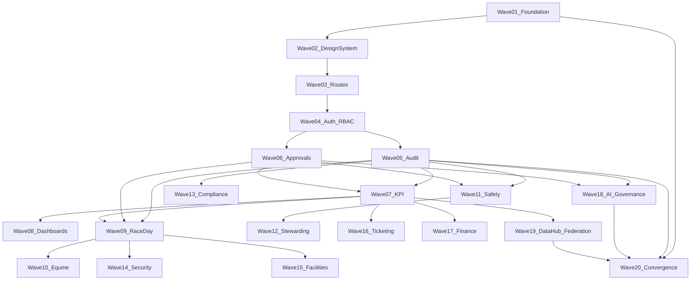

# TrackMind Nexus Feature Implementation Master Plan

This document is the **primary execution roadmap** for building the full Racing Operating System. It supersedes ad-hoc page builds and defines 20 implementation waves with a repeatable 14-step protocol.

**Source-of-truth hierarchy:**

1. `packages/shared/src/apiContracts.ts` — API routes, DTOs, roles, events, audit tags
2. `packages/shared/src/accessControl.ts` — RBAC and protected actions
3. `apps/frontend/src/routes/routes.ts` — workspace registry and support status
4. This document — wave sequencing and exit criteria
5. Historical docs — reference only

**Non-negotiable platform rules:**

- Every workspace maps to a backend read model
- Every mutation is approval-gated or draft-only
- AI outputs are advisory-only with evidence, confidence, and audit linkage
- Tenant isolation via scope headers (`organizationId`, `tenantId`, `racetrackId`)

---

## Feature Inventory (First-Class Capabilities)

### Foundation
Multi-tenant SaaS, organization management, racetrack management, user management, RBAC, approval engine, audit engine, event bus, CQRS readiness, digital twin framework, API-first architecture, KPI artifact framework, AI governance framework, notification framework, global search, system observability, feature flags, environment management

### Race-Day Operations
Race scheduling, race timeline, race status tracking, paddock operations, gate readiness, steward command center, starter workflows, surface condition tracking, weather awareness, incident overlays, approval-governed operational actions, race-day KPI dashboards

### Equine Intelligence Platform
Horse profile, horse digital twin, ownership history, trainer assignments, racing starts, workouts, transportation records, welfare observations, veterinary records, privacy-scoped veterinary access, retirement management, eligibility engine, equine compliance tracking, equine KPI framework, equine audit history

### Safety and Incident Management
Incident reporting, incident triage, severity classification, response coordination, emergency workflow tracking, incident timeline, incident audit history, safety KPIs, safety recommendations, post-incident review workflows

### Stewarding
Steward notifications, inquiry management, incident review, decision support, evidence management, recommendation review, approval workflows, audit evidence tracking

### Compliance
Compliance controls, policy registry, HISA-aligned metadata, ISO 42001 readiness mapping, compliance evidence packets, compliance dashboards, compliance KPI framework, regulatory workflow tracking, compliance audit exports

### Security Operations
Restricted zone monitoring, access event tracking, personnel management, alert management, camera integration readiness, sensor integration readiness, security incident workflows, security KPI framework

### Facilities Management
Facility inventory, track surface management, barn management, gate management, utilities monitoring, maintenance requests, maintenance scheduling, facility incidents, facility KPIs

### Ticketing and Fan Experience
Ticket inventory, event attendance, fan analytics, guest services, venue capacity tracking, fan experience KPIs, digital ticket integrations, hospitality readiness

### Finance
Revenue tracking, expense tracking, budget tracking, financial KPI dashboards, operational cost monitoring, payout governance workflows, financial audit support

### Approval Platform
Approval requests, approval routing, escalations, expiration handling, multi-stage approvals, approval evidence, approval audit trail, approval KPI tracking

### Audit Platform
Immutable audit events, audit timeline, audit search, audit exports, approval linkage, KPI linkage, AI recommendation linkage, compliance evidence linkage

### AI Governance Platform
MoE routing, expert agents, recommendation registry, confidence scoring, evidence attachment, risk classification, human approval requirements, recommendation audit history, model metadata registry, prompt lineage, AI KPI tracking

### Racing Data Hub
Provider adapter framework, data ingestion, data validation, data normalization, entity resolution, data quality scoring, canonical artifact generation, data lineage tracking, data hub KPIs

### Multi-Track Federation
Federation registry, track metadata, data-sharing policies, aggregate benchmarking, anonymous analytics, federation KPIs, cross-track governance controls

### KPI Platform
KPI registry, KPI definitions, KPI snapshots, KPI thresholds, KPI trend analysis, KPI ownership, KPI audit linkage, KPI recommendation linkage, KPI federation aggregation

### Digital Twin Platform
Horse twins, facility twins, race twins, incident twins, operational twins, event synchronization, twin state history, twin audit linkage

### Notifications
Alerts, notifications, escalations, approval reminders, incident notifications, compliance notifications, AI recommendation notifications

### Search and Knowledge
Global search, horse search, incident search, audit search, KPI search, federated search, knowledge artifact search

### Analytics
Executive dashboards, operational dashboards, historical analytics, trend analysis, forecasting readiness, benchmarking readiness, KPI analytics

### Administration
Organizations, tenants, racetracks, users, roles, permissions, feature flags, module enablement, integration settings, API keys, retention policies, audit exports

---

## Wave Dependency Graph



---

## 14-Step Wave Protocol

Apply this sequence to every wave:

1. **Inspect existing code** — update `IMPLEMENTATION_TRACEABILITY.md`
2. **Reuse backend contracts** — extend `apiContracts.ts` only when gaps exist
3. **Normalize duplicates** — consolidate parallel implementations
4. **Create missing services** — `apps/api/src/services/` or `services/*`
5. **Create missing APIs** — wire handlers in `server.ts` or controllers
6. **Create missing frontend views** — `workspaces/views/`, `routes.ts`
7. **Create missing shared types** — `packages/shared/src/`
8. **Create missing tests** — `apps/api/tests/`, `packages/shared/tests/`, `apps/frontend/tests/`
9. **Create missing audit hooks** — `auditLog.ts` + `eventBus.ts`
10. **Create missing KPI definitions** — `kpiArtifacts.ts` + seeds
11. **Create missing documentation** — wave section + domain doc
12. **Run validation** — `npm run validate`
13. **Fix failures recursively** — no wave advance until green
14. **Continue to next wave** — bump `supportStatus` where criteria met

**Global exit criteria:**

- All wave endpoints exist in `apiEndpointContracts` with handler coverage
- Protected actions emit audit events and require approval tokens
- Frontend routes declare correct `backendPaths` via `paths.ts`
- Tests cover happy path + governance failure modes

---

## Implementation Waves

### Wave 01 — Foundation Platform

**Features:** Multi-tenant SaaS, org/racetrack/user management, event bus, CQRS readiness, digital twin framework, API-first, feature flags, environment management, observability

**Reuse:** `domainKernel.ts`, `saasModel.ts`, `eventBus.ts`, `events/*`, `digitalTwinFoundation.ts`, DB migrations 001/005/006/008/012

**Deliverables:** `tenantService.ts`, `featureFlags.ts`, `repositoryAdapter.ts`, platform CRUD APIs, environment config API

**Exit criteria:** `GET/POST /platform/organizations`, `/platform/tenants`, `/platform/racetracks`, `/platform/feature-flags/evaluate`, `/platform/environment` implemented and tested

---

### Wave 02 — Design System + App Shell

**Features:** Command shell, tenant/racetrack/role context, degraded/mock labeling, KPI strip, navigation groups

**Deliverables:** `NotificationCenter.tsx`, `DegradedStateBanner.tsx`, `SupportStatusBadge.tsx`, workspace loading skeletons

**Exit criteria:** AppShell shows notification slot, support status badges on all workspace headers

---

### Wave 03 — Route Architecture

**Features:** Route registry, permission guards, module enablement, backend path declarations

**Deliverables:** Routes `/admin`, `/analytics`, `/fan-experience`, `/notifications`; module enablement from feature flags; route coverage test

**Exit criteria:** All new routes registered with backend paths; coverage test passes

---

### Wave 04 — Identity, Auth, RBAC

**Features:** User management, roles, permissions, tenant-scoped sessions, identity governance

**Deliverables:** `identityService.ts`, user/role assignment APIs, auth abstraction, tenant RBAC policy store

**Exit criteria:** `GET/POST /platform/users`, `/platform/roles`, `/platform/access-requests` with permission enforcement

---

### Wave 05 — Audit Platform

**Features:** Immutable audit events, timeline, search, exports, cross-domain linkage

**Deliverables:** Audit persistence adapter, search API with filters, unified `appendAudit()` helper

**Exit criteria:** `GET /audit/search` with actor/domain/date filters; persistence via repository adapter

---

### Wave 06 — Approval Platform

**Features:** Requests, routing, escalations, expiration, multi-stage, evidence, audit trail

**Deliverables:** Durable approval store, escalation worker, approval reminders via notification service

**Exit criteria:** Approvals survive restart via repository; escalation simulation tested

---

### Wave 07 — KPI Platform

**Features:** Registry, definitions, snapshots, thresholds, trends, ownership, audit linkage

**Deliverables:** `kpiCalculationService.ts`, admin CRUD, threshold-change approval, consolidated KPI sources

**Exit criteria:** KPIs computed from event projections; admin endpoints for definitions/thresholds

---

### Wave 08 — Dashboard and Executive Analytics

**Features:** Executive dashboards, operational dashboards, trend analysis, forecasting readiness

**Deliverables:** `/analytics` workspace, federation benchmarking UI, dashboard promoted to `live-api`

**Exit criteria:** Analytics route shows KPI snapshots and trend data from calculation engine

---

### Wave 09 — Race-Day Operations

**Features:** Scheduling, timeline, paddock, gate readiness, starter workflows, surface/weather, race-day KPIs

**Deliverables:** `paddockOperations.ts`, race schedule/timeline API, gate readiness panels, approval-gated race commands

**Exit criteria:** `GET /race-operations/paddock`, `/race-operations/schedule`, race-day KPI pack registered

---

### Wave 10 — Equine Intelligence Platform

**Features:** Horse profile, digital twin, vet privacy, eligibility, compliance, equine KPIs

**Deliverables:** Frontend privacy API wiring, eligibility HTTP surface, equine KPI pack, vet audit hooks

**Exit criteria:** Frontend uses `/horses/{id}/*` paths; eligibility endpoint tested

---

### Wave 11 — Safety and Incident Management

**Features:** Reporting, triage, severity, emergency workflows, incident timeline, safety KPIs

**Deliverables:** Incident CRUD API (`/incidents/{id}`), safety-intelligence frontend wiring, post-incident review workflow

**Exit criteria:** Full incident lifecycle API with audit; safety KPI pack registered

---

### Wave 12 — Stewarding Platform

**Features:** Inquiries, evidence, decision support, recommendations, approvals, audit

**Deliverables:** Final-ruling invariants, evidence management API, steward notification integration

**Exit criteria:** Evidence upload/reference API; decision support panel links AI recommendations

---

### Wave 13 — Compliance Platform

**Features:** Controls, policy registry, HISA/ISO 42001, evidence packets, dashboards, regulatory workflows

**Deliverables:** Corrective-action lifecycle, compliance dashboard, evidence packet generation

**Exit criteria:** Corrective actions full CRUD; compliance KPI pack registered

---

### Wave 14 — Security Operations

**Features:** Restricted zones, access events, camera/sensor readiness, security incidents, KPIs

**Deliverables:** Zone monitoring UI, webhook adapter endpoints, security KPI pack

**Exit criteria:** `GET /security-operations/zones/live`; camera/sensor readiness endpoints

---

### Wave 15 — Facilities Management

**Features:** Inventory, maintenance, utilities, facility incidents, KPIs

**Deliverables:** Geospatial map component, maintenance scheduling mutations, utilities adapter interfaces

**Exit criteria:** Maintenance schedule approval-gated POST; facility KPI pack registered

---

### Wave 16 — Ticketing and Fan Experience

**Features:** Ticket inventory, attendance, fan analytics, guest services, capacity, KPIs

**Deliverables:** `/fan-experience` route, `FanExperienceRequest` handlers, attendance/capacity APIs

**Exit criteria:** Fan experience workspace live; ticketing split from finance endpoint

---

### Wave 17 — Finance Platform

**Features:** Revenue/expense/budget, KPI dashboards, payout governance, audit support

**Deliverables:** Separate finance workspace API, revenue/settlement read models, budget tracking

**Exit criteria:** `GET /services/finance/workspace` distinct from ticketing; finance KPI pack

---

### Wave 18 — AI Governance and MoE Platform

**Features:** MoE routing, recommendation registry, model metadata, prompt lineage, AI KPIs

**Deliverables:** Model/prompt card API registry, prompt lineage tracking, AI KPI pack

**Exit criteria:** `GET /ai-governance/model-cards`, `/ai-governance/prompt-cards` with lineage

---

### Wave 19 — Racing Data Hub and Federation

**Features:** Provider adapters, ingestion, entity resolution, federation benchmarking

**Deliverables:** Provider adapter execution, entity resolution UI, federation KPI aggregation

**Exit criteria:** Connector execution endpoint; federation KPIs feed analytics

---

### Wave 20 — Full Repository Convergence and Production Hardening

**Features:** Notifications, global search, digital twin convergence, admin module, production deployment

**Deliverables:** Unified notification framework, global search API, Postgres repository wiring, service extraction readiness, `facade-api` → `live-api` promotion

**Exit criteria:** `GET /search/global`; notification delivery adapters; contract coverage report; all routes `live-api` or `degraded`

---

## Cross-Wave Conventions

| Concern | Convention |
|---------|------------|
| Event names | `{domain}.{entity}.{action}.v1` per `foundation.ts` |
| Audit tags | `{module}:{action}:{resourceType}` on every mutation |
| KPI IDs | `{domain}-{metric-slug}` in `kpiArtifacts.ts` |
| API paths | `/api/v1/{domain}/{resource}` in `apiContracts.ts` |
| Tests | `{module}.test.mjs` in `apps/api/tests/` |
| Docs | Update `IMPLEMENTATION_TRACEABILITY.md` per vertical slice |

---

## Validation Commands

```bash
npm run migrations:validate
npm run typecheck
npm test
npm run build:all
npm run perf:smoke   # Wave 20+
```

---

## Execution Strategy

1. One wave per agent session — follow the 14-step protocol
2. Contract-first diffs — `packages/shared` → `apps/api` → `apps/frontend`
3. No autonomous safety actions — preserve approval gates
4. Track progress — update `supportStatus` in `routes.ts` and traceability table after each wave
