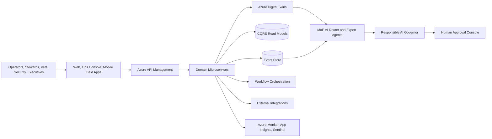

# TrackMind Nexus Enterprise Blueprint

TrackMind Nexus is an Azure-first enterprise monorepo for Thoroughbred racetrack operations. It organizes racetrack domains as independently deployable services connected by event sourcing, CQRS read models, Digital Twin state, Mixture-of-Experts AI recommendations, and human-governed automation.

## Platform goals

- Support multi-racetrack deployments with tenant isolation at identity, data, event, secret, and observability boundaries.
- Manage racing operations, safety, stewarding, facilities, security, ticketing, wagering integrations, compliance, customer experience, and finance through API-first services.
- Represent every track, barn, paddock, horse, person, asset, sensor, camera, incident, and workflow as a governed Digital Twin entity.
- Route AI work through a Mixture-of-Experts system with policy gates, confidence thresholds, evidence capture, model lineage, and mandatory human approvals for regulated or safety-critical actions.
- Use Azure-native managed services by default and keep all deployment assets reproducible with Infrastructure-as-Code.

## Logical architecture

## Domain repository map

- `apps/` contains user-facing applications, including operations dashboards, administrative portals, and mobile field tools.
- `services/` contains bounded-context backend services for race operations, safety, stewarding, tenancy, event ingestion, and future domains.
- `digital-twin/` contains ontology, simulation, synchronization, and connector assets for Azure Digital Twins.
- `ai/` contains MoE routing, expert agents, evaluation harnesses, model cards, and responsible AI controls.
- `workflows/` contains durable workflow definitions and workers for human-in-the-loop processes.
- `compliance/` contains control catalogs, evidence collection, policy-as-code mappings, and audit runbooks.
- `integrations/` contains adapters for HISA, wagering providers, weather, camera systems, IoT, and payment/fan systems.
- `infra/` contains Azure Bicep/Terraform modules, environment overlays, Azure Policy, managed identities, network, observability, and security baselines.
- `tests/` contains cross-service contract, end-to-end, performance, and security tests.
- `deploy/` contains CI/CD templates, release automation, Helm/Kubernetes assets, and operational scripts.

## Azure reference services

| Capability | Azure-first baseline |
| --- | --- |
| API management | Azure API Management, Entra ID, workload identity |
| Compute | Azure Container Apps for services, AKS for high-control workloads, Azure Functions for event handlers |
| Events | Azure Event Hubs for streaming, Service Bus for commands/work queues, Event Grid for integration events |
| Event sourcing | Azure Cosmos DB or PostgreSQL append-only event store with immutable retention policies |
| CQRS reads | Azure SQL, PostgreSQL, Cosmos DB, Azure AI Search, Redis Enterprise |
| Digital Twin | Azure Digital Twins with DTDL ontology and Event Grid routes |
| AI | Azure OpenAI, Azure AI Foundry, managed model registry, Prompt Flow/evaluation pipelines |
| Observability | Azure Monitor, Application Insights, Log Analytics, Managed Prometheus/Grafana, Microsoft Sentinel |
| Secrets | Azure Key Vault with private endpoints and managed identities |
| Data lake | Microsoft Fabric/OneLake or ADLS Gen2 for analytics and compliance evidence |

## Safety and governance invariants

1. AI recommendations are advisory until a permitted human approver records an approval.
2. Race starts/stops, official results, scratches, medication decisions, emergency response, payouts, and disciplinary actions require explicit workflow authorization.
3. Every command, decision, model output, approval, and integration call emits an immutable audit event.
4. Tenant context is mandatory for every request, event, secret, database row, blob, and telemetry record.
5. Services publish events and own their write models; other services consume events and build read models.
