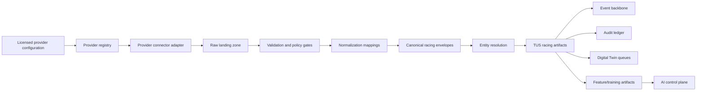

# TrackMind Racing Data API Hub

The TrackMind Racing Data API Hub is the provider-agnostic ingestion architecture for licensed racing data. It gives TrackMind Nexus a controlled way to register data providers, record license and usage terms, land raw payloads, validate and normalize records, create canonical racing artifacts, publish governed events, and make eligible data available to Digital Twin, analytics, feature, compliance, and AI control-plane workflows.

This document is an architecture and metadata contract. It does not claim that any external provider is currently integrated, licensed, certified, approved, or commercially usable. External names or categories should be treated only as adapter-ready examples until a deployment has signed terms, configured credentials, verified permissions, and passed provider-specific acceptance checks.

## Related Documentation

- [Racing Operating System and Standardization Framework](racing-operating-system-standardization-framework.md)
- [TrackMind Universal Artifact Framework](universal-artifact-framework.md)
- [Tier 9 Unified Data Model](unified-data-model.md)
- [TrackMind Nexus Event Backbone](event-backbone.md)
- [TrackMind Unified AI/ML Control Plane](unified-ai-ml-control-plane.md)
- [Responsible AI Governance Platform](../compliance/responsible-ai-governance-platform.md)
- [HISA-Aligned Readiness Mapping](../compliance/HISA.md)
- [ARCI Compliance Mapping](../compliance/ARCI.md)

## Purpose

The hub standardizes how racing data enters TrackMind without hard-coding any single provider or weakening licensing controls. Its purpose is to:

- keep provider configuration, health, credentials references, and license metadata tenant- and racetrack-scoped;
- accept only authorized connection modes such as official APIs, vendor feeds, SFTP, webhooks, manual uploads, partner shares, SDKs, streams, file drops, or data clean rooms;
- preserve raw payloads in a landing zone with hashes, provenance, retention, license snapshots, event references, and audit references;
- validate schema, license, usage, privacy, quality, freshness, and duplicate rules before downstream use;
- normalize provider-specific records into `trackmind.racing-data-api-hub.v1` envelopes and TUS-compatible artifacts;
- support entity resolution for horses, people, races, tracks, assets, and source aliases without making uncertain matches authoritative;
- expose only governed, license-compatible read models to APIs, dashboards, features, and AI workflows.

## Source Categories

TrackMind should treat sources as categories with provider-specific adapters, not as built-in provider dependencies:

- **Race administration**: race cards, entries, post positions, declarations, scratches, results, official status changes, race-day schedules, and track configuration.
- **Equine and participant records**: horse profiles, workouts, ownership, trainer and jockey profiles, licenses, veterinary status, eligibility, and welfare observations.
- **Stewarding and compliance evidence**: steward decisions, inquiries, appeals, regulatory evidence packages, local commission evidence, HISA-aligned readiness data, and ARCI-aligned rule evidence.
- **Surface, weather, and telemetry**: track condition, moisture, cushion depth, maintenance activities, weather observations, sensors, cameras, IoT devices, and track-owned operational systems.
- **Wagering and financial context**: odds, pools, handle summaries, settlement references, and integrity signals, where licensed and usage-compatible.
- **Media and analytics**: video metadata, partner media references, timing data, performance analytics, research datasets, and manually uploaded files.

Provider examples such as racing data vendors, regulatory systems, wagering platforms, weather services, camera systems, or track-owned databases are adapter-ready categories only. A category in this document is not evidence of a live integration or a data license.

## No Scraping And No Public Redistribution Assumption

The default assumption is no scraping and no public redistribution.

- The provider registry must reject scraping, screen-scraping, crawler, or other unauthorized extraction connection types.
- Credentials are referenced by `authRef` or `credentialsRef`; secrets must not be stored in provider metadata, payload metadata, frontend state, or documentation.
- `redistributionAllowed` is treated as false unless a provider license snapshot explicitly permits redistribution for the requested use.
- Public, fan-facing, commercial, wagering-support, federation-exchange, research, and AI-training outputs require explicit `usageScope` compatibility.
- Raw provider payloads are internal governed evidence. They should not be rendered publicly, exported broadly, or used as training data unless license, privacy, retention, and tenant approvals allow that use.

## Architecture Flow

The flow follows the Universal Artifact Framework: `INPUTS -> EVENTS -> ARTIFACTS -> DIGITAL TWINS -> FEATURE STORE -> AI MODELS -> RECOMMENDATIONS -> APPROVALS -> OUTPUTS -> AUDITS`. The hub owns the ingestion and canonicalization path; protected operational decisions remain owned by TrackMind workflows, approvals, audit, and authorized humans.

## Provider Connector Model

The provider model is split between registry metadata and connector runtime behavior.

The registry records `ProviderConfig`, `ProviderStatus`, license status, connection type, sync mode, endpoint references, credential references, data classes, usage scopes, retention, PII flags, attribution, audit refs, event refs, evidence refs, and health. It is tenant- and racetrack-scoped and should expose provider metadata through the provider registry service, not through ad hoc configuration files.

Connector adapters must be provider agnostic:

- `ProviderConnectorDescriptor.providerAgnostic` is `true`.
- `ProviderConnectorDescriptor.hardCodedProviderBehaviorAllowed` is `false`.
- Supported connection types and sync modes are declared before use.
- Adapter-specific credentials are read through secret references, not embedded metadata.
- Health checks, rate limits, cursors, retries, dead letters, and provider error states are observable.
- Provider-specific parsing is isolated behind normalization mappings so the canonical artifacts do not inherit provider naming or licensing assumptions.

Manual-upload and mock adapters are useful for tests, demos, and reference slices. They must remain clearly labeled and read-only for operational decisioning.

## Raw Landing Zone

The raw landing zone preserves the original provider payload and its license snapshot. A raw payload artifact should include:

- provider ID and provider display name;
- tenant ID, racetrack ID, jurisdiction, and source endpoint;
- source format or content type;
- received timestamp, ingestion job ID, correlation ID, and source refs;
- payload hash, event refs, audit refs, evidence refs, and retention policy;
- license status, allowed usage scopes, restricted uses, attribution requirements, redistribution flag, commercial-use flag, PII flag, and expiration.

Raw payloads are append-only evidence artifacts. They support replay, audit reconstruction, reconciliation, and provider dispute handling, but downstream work should consume normalized canonical envelopes whenever possible.

## Validation

Validation runs before records become canonical racing artifacts. Required gates include:

- **License gate**: license status, expiration, usage scope, attribution, commercial use, redistribution, retention, and evidence refs.
- **Schema gate**: required fields, data class, content type, source refs, tenant/racetrack context, and canonical schema version.
- **Quality gate**: completeness, freshness, duplicate detection, source consistency, parse errors, outliers, and provider status.
- **Privacy gate**: PII/veterinary/workforce/security flags, restricted fields, minimization, role-based access, and legal-hold posture.
- **Training gate**: `ai-training` usage scope, tenant permission, lineage, de-identification or minimization, and exclusion of stale or missing-evidence records.
- **Operational gate**: clear separation between external data, TrackMind read models, and official human-controlled racing decisions.

Rejected payloads should remain auditable with rejection reasons, but they should not create canonical envelopes, features, Digital Twin patches, dashboard facts, or AI inputs.

## Normalization

Normalization mappings translate provider-specific fields into the hub schema and TrackMind Unified Schema artifacts. Each mapping should declare:

- source schema reference and target schema version;
- data class such as `race-card`, `entries`, `results`, `scratches`, `workouts`, `horse-profile`, `participant-profile`, `track-condition`, `weather`, `odds`, `pools`, `steward-decisions`, `veterinary`, `compliance`, `media`, or `analytics`;
- field mappings, required transforms, quality rules, PII paths, license snapshot, lineage, evidence refs, audit refs, and event refs;
- status values such as draft, active, deprecated, or retired.

Normalization creates `CanonicalRacingDataEnvelope` records, not final authority. The envelope says what TrackMind received and how it normalized the source under current terms; official status remains controlled by the appropriate racing office, steward, veterinarian, regulator, or track authority.

## Canonical Racing Artifacts

Canonical envelopes can become TUS-compatible artifacts when validation and normalization succeed. Common artifacts include:

- racetrack, meet, race day, race, race card, race entry, post position, declaration, scratch, result, payout reference, and official status context;
- horse, ownership, trainer, jockey, veterinarian, steward, employee, credential, license, eligibility, welfare observation, workout, and veterinary review context;
- surface measurement, weather observation, maintenance activity, track condition, rail position, gate state, sensor reading, camera metadata, and asset state;
- steward inquiry, decision support evidence, appeal package, compliance evidence, regulatory filing draft, and local rule reference;
- odds, pool, wagering-integrity signal, financial summary, media reference, analytics product, and research artifact where licensed.

These artifacts should carry TUS global IDs, tenant/racetrack scope, source-system IDs, event refs, audit refs, evidence refs, Digital Twin refs when applicable, feature refs when eligible, and license restrictions.

## Entity Resolution

Entity resolution joins external source IDs to TrackMind records without overclaiming certainty. The hub should support:

- source aliases for horses, people, races, tracks, assets, providers, and organizations;
- deterministic identifiers where supplied by authoritative local records;
- fuzzy matches with confidence, evidence, and review status;
- conflict records when two providers disagree or a provider payload conflicts with local TrackMind state;
- human review queues for uncertain horse identity, participant identity, official result, scratch, veterinary, stewarding, or regulated records;
- audit entries for merges, splits, overrides, and rejected candidate matches.

Resolved IDs should use existing TrackMind conventions such as `tus:<tenantId>:<racetrackId>:<kind>:<id>` and Digital Twin references such as `twin:<context>:<entity-id>`. Unresolved or low-confidence records remain quarantined from protected workflows and AI training.

## Feature And Training Artifacts

The hub may feed feature metadata and training artifacts only after licensing, quality, privacy, and tenant gates pass. Eligible artifacts should include:

- feature record refs, source payload refs, canonical envelope refs, evidence refs, audit refs, event refs, and dataset lineage;
- license snapshot showing `ai-training` or another compatible use scope;
- minimization, de-identification, redaction, or aggregation decisions;
- stale-input and low-quality flags;
- protected-action labels that prevent models from learning autonomous execution for race starts, stops, official results, scratches, veterinary clearances, steward rulings, payouts, emergency overrides, or safety-critical controls.

Training and model improvement must follow the AI Control Plane and Universal Artifact Framework policies. Cross-tenant training, benchmarking, and federation concepts require anonymized, aggregate-only, permission-governed records with explicit data-sharing policy and cohort thresholds.

## Data Quality And Observability

The hub should expose quality and health signals for:

- provider status, auth state, rate limits, latency, sync cursors, last successful sync, next sync, and error rates;
- ingestion jobs queued, running, completed, completed-with-errors, failed, and cancelled;
- raw payload counts, normalized counts, rejected counts, duplicate counts, and quarantine counts;
- mapping version coverage, deprecated mappings, field-level parse failures, PII detections, and attribution requirements;
- completeness, freshness, source reconciliation, entity-resolution confidence, and license expiration risk;
- downstream event, audit, Digital Twin, feature-store, and AI-control-plane sync posture.

Quality failures should publish events, write audit evidence, and keep affected records out of operational and AI surfaces until remediated or explicitly excepted by an authorized human process.

## Licensing And Usage Policy

Every provider, raw payload, normalization mapping, canonical envelope, feature record, export, and dashboard surface must carry compatible usage metadata. At minimum:

- license status is required and should be treated as unknown, evaluation, active, restricted, expired, suspended, or revoked;
- allowed usage scopes must be explicit, such as internal operations, race-day operations, analytics, AI training, fan experience, wagering support, compliance reporting, federation exchange, commercial product, or research;
- commercial use, redistribution, attribution, PII, retention, legal basis, terms reference, and expiration are explicit fields;
- restricted or expired records remain available only for authorized audit, legal hold, remediation, or evidence workflows;
- public redistribution, commercial products, AI training, research, and federation exchange are blocked unless the license snapshot and tenant policy explicitly permit them;
- provider terms are enforced at the artifact and API layer, not only at connector configuration time.

This page is not legal advice. Each deployment needs provider contracts, jurisdiction-specific review, and data protection review before operational or commercial use.

## Events

The current reference modules include provider registry events and connector runtime ingestion events. The architecture should align those events with the Nexus event backbone so provider activity is replayable and auditable.

Current/reference event families:

- `provider.registry.registered`
- `provider.registry.status-updated`
- `provider.ingestion.completed`
- `provider.ingestion.rejected`

Target Nexus catalog names should use `context.entity.verb.vN` naming when promoted to full event contracts, for example:

- `racing-data.provider.registered.v1`
- `racing-data.provider.statusChecked.v1`
- `racing-data.ingestion.started.v1`
- `racing-data.ingestion.completed.v1`
- `racing-data.ingestion.rejected.v1`
- `racing-data.payload.landed.v1`
- `racing-data.payload.validated.v1`
- `racing-data.payload.quarantined.v1`
- `racing-data.envelope.normalized.v1`
- `racing-data.entity-resolution.candidateCreated.v1`
- `racing-data.license.violationBlocked.v1`
- `racing-data.quality.exceptionRecorded.v1`

Events require tenant ID, racetrack ID, aggregate ID, correlation ID, actor, subject, evidence, audit refs, source provider refs, and license metadata where applicable.

## API Endpoints

The provider registry currently declares metadata endpoints under `/api/v1/providers`. Other Racing Data API Hub endpoints below are architecture targets unless an implementation explicitly exposes them.

| Endpoint | Status | Purpose |
| --- | --- | --- |
| `POST /api/v1/providers` | current registry contract | Register licensed provider configuration metadata. |
| `GET /api/v1/providers` | current registry contract | List tenant/racetrack-scoped provider configurations. |
| `GET /api/v1/providers/{providerId}` | current registry contract | Read provider configuration and license status. |
| `GET /api/v1/providers/{providerId}/status` | current registry contract | Read provider health and sync status. |
| `PATCH /api/v1/providers/{providerId}/status` | current registry contract | Update provider health and sync status. |
| `GET /api/v1/providers/snapshot` | current registry contract | Serialize provider registry metadata for audit and frontend reads. |
| `GET /api/v1/racing-data-api-hub/metadata` | target | Return `RacingDataApiHubServiceMetadata`. |
| `GET /api/v1/racing-data-api-hub/connectors` | target | List provider-agnostic connector descriptors. |
| `POST /api/v1/racing-data-api-hub/ingestion-jobs` | target | Start an approved ingestion job. |
| `GET /api/v1/racing-data-api-hub/ingestion-jobs` | target | List ingestion jobs and outcomes. |
| `GET /api/v1/racing-data-api-hub/raw-payloads/{payloadId}` | target, restricted | Read raw payload evidence only for authorized audit/support roles. |
| `GET /api/v1/racing-data-api-hub/normalization-mappings` | target | List mapping versions and quality rules. |
| `POST /api/v1/racing-data-api-hub/normalization-mappings/draft` | target | Draft mapping changes for review and audit. |
| `GET /api/v1/racing-data-api-hub/canonical-envelopes` | target | Read normalized canonical envelopes. |
| `GET /api/v1/racing-data-api-hub/entity-resolution/candidates` | target | Review unresolved or low-confidence matches. |
| `GET /api/v1/racing-data-api-hub/quality` | target | Read provider, ingestion, mapping, and artifact quality posture. |
| `POST /api/v1/racing-data-api-hub/training-artifacts/draft` | target | Draft AI-training artifacts after license and privacy gates pass. |

Protected mutation endpoints must require idempotency, tenant/racetrack scope, actor identity, evidence, audit records, and approval workflow integration where the action affects regulated records, public redistribution, training eligibility, or downstream operational state.

## Frontend Workspaces

The canonical frontend navigation reserves `/data-hub` for the Racing Data API Hub workspace. The workspace should remain read-only unless backed by live authorization and approval workflows. It should surface:

- provider registry cards with license status, usage scope, attribution, PII, retention, redistribution, and commercial-use controls;
- connector health, sync mode, rate limit, latency, last sync, next sync, and degraded state;
- ingestion job timeline, raw payload refs, validation errors, quarantine counts, and audit refs;
- normalization mappings, schema versions, data classes, quality rules, and deprecated mappings;
- canonical envelope counts by data class, tenant, racetrack, provider, and source system;
- entity-resolution candidates and human review queues;
- AI-training eligibility summaries with blocked reasons;
- event stream, audit ledger, Digital Twin sync, and feature-store sync status.

Mock or placeholder data must be labeled and must not be safe for operational decisioning. Raw payload bodies should be hidden by default; the frontend should show hashes, refs, license flags, quality summaries, and audit links unless a privileged audit/support role explicitly opens raw evidence.

## Digital Twin, Event, And Audit Integration

The hub integrates with shared TrackMind infrastructure as follows:

- **Events** publish provider, ingestion, validation, normalization, quality, license, and entity-resolution transitions through the Nexus event backbone.
- **Audit** records provider registration, status changes, ingestion outcomes, validation rejections, license blocks, mapping changes, entity-resolution decisions, exports, and training-artifact eligibility decisions.
- **Digital Twin** consumes only validated canonical artifacts or approved sync plans. Raw payloads and uncertain entity-resolution candidates should not patch Digital Twin state.
- **Compliance** reuses evidence refs for HISA-aligned, ARCI-aligned, ISO/IEC 42001, NIST AI RMF, ISO 27001, ISO 27701, ISO 31000, SOC 2, PCI DSS, and local racing-rule readiness mappings.
- **AI Control Plane** receives only eligible, lineaged inputs and feature records. It should preserve source refs, quality flags, license scopes, training restrictions, and blocked-action policy decisions.

Digital Twin state is operational context, not the legal source of truth for official results, scratches, veterinary clearance, steward rulings, payouts, or emergency commands.

## AI Training Restrictions

Racing Data API Hub artifacts are not automatically available for AI training. Training use requires:

- provider license scope that explicitly permits AI training or model improvement;
- tenant and racetrack policy approval;
- compatible retention, attribution, redistribution, commercial-use, and privacy terms;
- minimization or de-identification of PII, veterinary, workforce, security, financial, and regulated data;
- quality thresholds for freshness, completeness, source evidence, and entity-resolution confidence;
- event, audit, raw payload, canonical envelope, feature, dataset, model, prompt, evaluation, and recommendation lineage;
- explicit exclusion from autonomous protected-action execution.

Do not use raw cross-tenant records for training, benchmarking, federation exchange, research, or commercial products. Any future Racing Intelligence Network output must remain anonymized, aggregate-only, permission-governed, and compatible with provider and tenant data-sharing terms.

## Current Repository State

The repository currently contains:

- shared Racing Data API Hub DTOs and validation helpers in `packages/shared/src/racingDataApiHub.ts`;
- a provider registry reference service in `apps/api/src/providerRegistryService.ts`;
- a connector runtime, raw landing service, manual adapter, mock adapter, ingestion jobs, validation hooks, ingestion audit refs, and ingestion events in `apps/api/src/connectorRuntime.ts`;
- a frontend navigation entry for `/data-hub`;
- existing Universal Artifact, TUS, event backbone, audit, Digital Twin, compliance, and AI control-plane documentation that the hub must follow.

These are contracts and reference slices. Production deployment still requires provider-specific agreements, secrets management, connector hardening, persistent stores, endpoint implementation, operational runbooks, security review, compliance review, data protection review, provider acceptance testing, and tenant-specific usage policy approval.
