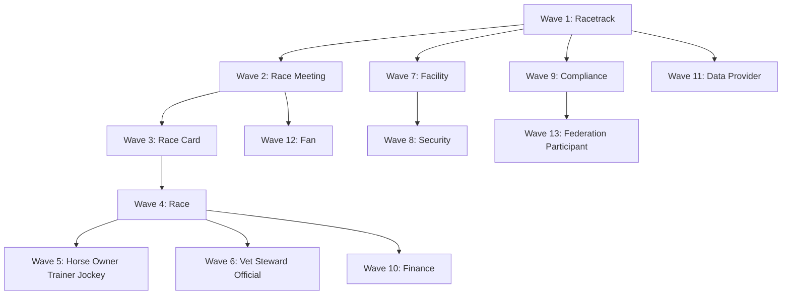

# Racing Operating Model and Expansion Sequence

## Purpose

TrackMind Nexus is a **Racing Operating System (ROS)**. This document defines the canonical operating model that precedes technology implementation. Every racing lifecycle capability must materialize across eleven convergence dimensions before it is treated as operationally authoritative.

The executable contract lives in `packages/shared/src/racingOperatingModel.ts` with normalization in `packages/shared/src/racingOsConvergence.ts`. API surfaces:

- `GET /api/v1/ros/operating-model` — full model with capabilities and artifact bindings
- `GET /api/v1/ros/convergence` — per-domain convergence report across all eleven dimensions
- `GET /api/v1/ros/expansion-sequence` — ordered 13-wave implementation sequence

This is an operating-model and readiness reference. It does not claim that every artifact binding marked `implemented` has production-grade durable persistence, live external integrations, or formal certification.

## Central Principle

**Build from the racing operating model first; implement technology around governed lifecycles.**

Technology artifacts are projections of operational truth, not substitutes for human authority on protected decisions.

## Lifecycle Domains

TrackMind models eighteen first-class operating domains:

| Domain | Domain Entity | OS Branch | Owner Role |
|--------|---------------|-----------|------------|
| Racetrack | `racetrack` | Operations | Track Superintendent |
| Race Meeting | `race-meet` | Operations | Racing Secretary |
| Race Card | `race-card` | Operations | Racing Secretary |
| Individual Race | `race` | Operations | Racing Secretary |
| Horse | `horse` | Safety | Veterinarian |
| Owner | `owner` | Operations | Racing Secretary |
| Trainer | `trainer` | Operations | Racing Secretary |
| Jockey | `jockey` | Safety | Steward |
| Veterinarian | `veterinarian` | Safety | Veterinarian |
| Steward | `steward` | Compliance | Steward |
| Official | `official` | Operations | Racing Secretary |
| Facility | `facility`, `barn`, `stall` | Operations | Track Superintendent |
| Fan | `fan` | Commerce | Ticketing Manager |
| Security | `security-event` | Safety | Security |
| Compliance | `compliance-record` | Compliance | Compliance Officer |
| Finance | `finance-record` | Commerce | Finance |
| Data Provider | `data-provider` | Intelligence | Operations Admin |
| Federation Participant | `federation-participant` | Federation | Admin |

## Eleven Racing OS Convergence Dimensions

Every capability must define bindings for:

1. **Domain model** — canonical entity in `domainKernel.ts` with lifecycle state and validation
2. **Shared types** — TypeScript contracts exported from `@trackmind/shared`
3. **API layer** — registered endpoint in `apiContracts.ts` with RBAC and tenant scope
4. **Database support** — canonical migration and seed references
5. **Events** — `context.entity.verb.vN` envelope on the event backbone
6. **Approvals** — protected-action mapping with human authorization
7. **Audits** — hash-chained immutable record with evidence custody
8. **KPIs** — governed metric in `kpiArtifacts.ts` with thresholds and audit refs
9. **Dashboards** — frontend workspace route for role-aware decision support
10. **AI context support** — model-readable boundary with intended/prohibited use
11. **Documentation** — architecture anchor and export/evidence templates

Artifact implementation status values:

- `implemented` — working reference slice in repository
- `partial` — core path exists; hardening remains
- `wired-reference` — contracts and UI wiring without production backing
- `readiness-metadata` — operating-model definition only
- `next-hardening` — planned maturity step

## Expansion Sequence (13 Waves)

Dependencies flow from venue foundation through federation network:

| Wave | Title | Domains | Technology Milestone |
|------|-------|---------|---------------------|
| 1 | Venue Foundation | Racetrack | Domain kernel + track configuration |
| 2 | Meet Operations | Race Meeting | Race office read model + meet events |
| 3 | Card Publishing | Race Card | Race card entity + canonical normalization |
| 4 | Race Execution | Race | Race lifecycle + command center |
| 5 | Equine Registry | Horse, Owner, Trainer, Jockey | Equine intelligence platform |
| 6 | Governance People | Veterinarian, Steward, Official | Stewarding + vet privacy + officials |
| 7 | Physical Infrastructure | Facility | RACR + facilities maintenance |
| 8 | Security Operations | Security | Security SOC workspace |
| 9 | Compliance Posture | Compliance | Compliance command center |
| 10 | Financial Governance | Finance | Finance platform workspace |
| 11 | Data Integration | Data Provider | Racing data API hub |
| 12 | Fan Experience | Fan | Fan experience + ticketing |
| 13 | Federation Network | Federation Participant | Federation intelligence workspace |

## 14-Step Implementation Protocol (Per Wave)

For each wave, follow the master plan protocol from `FEATURE_IMPLEMENTATION_MASTER_PLAN.md`:

1. Extend `domainKernel.ts` entity kinds and schemas
2. Register DTOs and endpoints in `apiContracts.ts`
3. Add event types to event catalog and access control
4. Define KPI artifacts with thresholds and ownership
5. Wire audit actions and integrity references
6. Map protected actions to approval workflows
7. Implement canonical API service (not Nexus facade first)
8. Add database migration if promoting to durable storage
9. Register frontend route in `routes.ts` and `paths.ts`
10. Build dashboard workspace with degraded/empty states
11. Add report template to `config/platform-expansion/report-templates.json`
12. Register AI context boundaries in control plane
13. Add contract tests in `packages/shared/tests/`
14. Update `IMPLEMENTATION_TRACEABILITY.md` coverage row

## Relationship to Other ROS Documents

- **Standardization framework** (`racing-operating-system-standardization-framework.md`) — ten tiers and nine OS branches
- **Universal artifact framework** (`universal-artifact-framework.md`) — artifact flow from inputs through audits
- **Feature master plan** (`FEATURE_IMPLEMENTATION_MASTER_PLAN.md`) — twenty frontend/backend waves
- **Nexus upgrade package** (`nexusUpgrade.ts`) — twenty-one workspace projections

This operating model is the **domain-first sequencing layer**. The master plan waves implement UI and runtime depth; this document defines **what** must exist and **in what dependency order**.

## Safety Constraints

Protected lifecycle transitions require human approval. AI may populate AI context sources and advisory dashboards but must not autonomously execute race commands, official results, veterinary clearances, steward rulings, payouts, or safety-critical controls.

Federation participants may only expose aggregate, anonymized benchmarks — never raw cross-tenant records.
