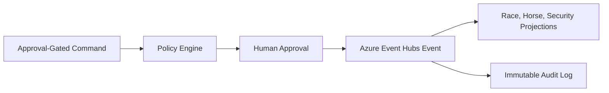

# Technical Documentation

## Architecture

TrackMind uses a Command -> Event -> Projection flow:

## Test Results

- `apps/api/tests/apex-domain-services.test.mjs`
- `apps/api/tests/cqrs-event-architecture.test.mjs`
- `apps/frontend/tests/frontend-contracts.test.mjs` verifies the canonical frontend shell, route registry, scoped API adapter headers, mock isolation, KPI adapter wiring, Vite proxy boundary, and absence of direct regulated action controls.

## Certificates

This package records internal readiness evidence only. It does not claim external certification.
