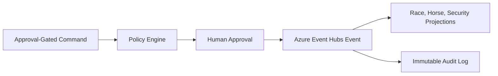

# Technical Documentation

## Architecture

TrackMind uses a Command -> Event -> Projection flow:

## Test Results

- `apps/api/tests/apex-domain-services.test.mjs`
- `apps/api/tests/cqrs-event-architecture.test.mjs`
- `apps/dashboard/tests/race-day-command-dashboard.test.mjs`

## Certificates

This package records internal readiness evidence only. It does not claim external certification.
