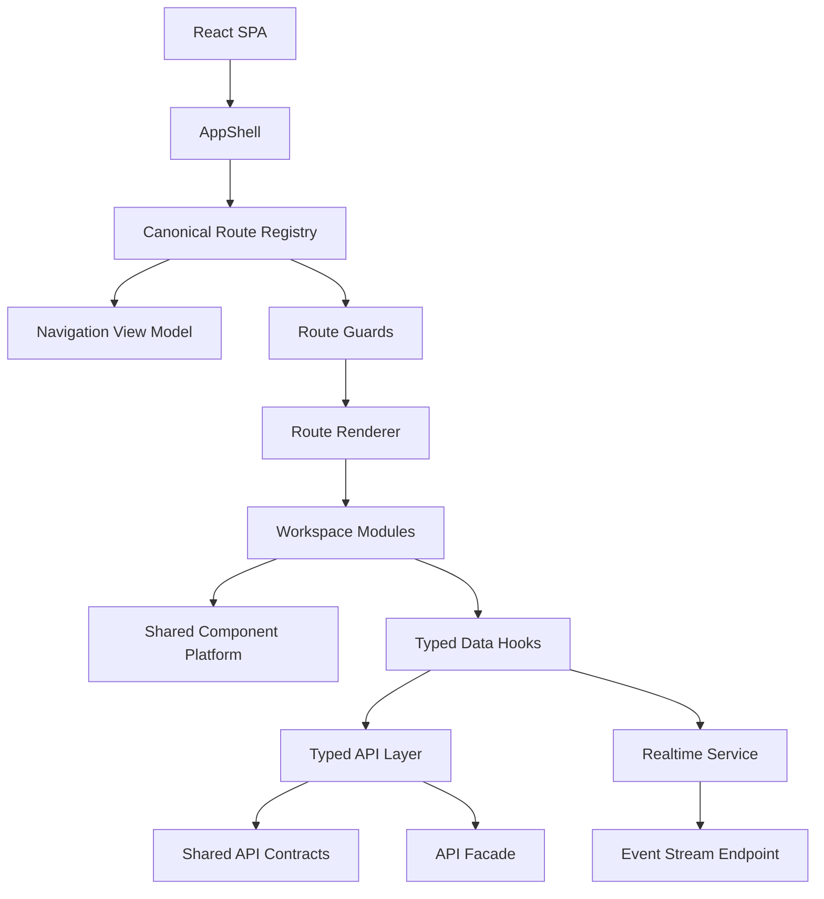

# TrackMind Nexus Frontend Migration Inventory

## Scope

This inventory captures the frontend state before business-logic migration. It documents active layouts, shells, routes, navigation, APIs, component systems, theme systems, mock adapters, deprecated routes, duplicate components, and migration risks for the TrackMind Nexus SPA migration.

## Current Frontend Shape

The dashboard currently renders through a custom React SSR server in `apps/dashboard/src/server.tsx`. The active experience is `CommandCenter` in `apps/dashboard/src/App.tsx`, backed by a centralized Nexus API client in `apps/dashboard/src/api/client.ts`.

The app already has strong Nexus foundations:

- 22 canonical workspace routes are registered in `apps/dashboard/src/shell/navigation.ts`.
- Domain ownership, live API metadata, event streams, personas, mock posture, and approval actions are registered in `apps/dashboard/src/shell/domains.ts`.
- Tenant options, breadcrumbs, command palette items, and service banners are defined in `apps/dashboard/src/shell/experience.ts`.
- Shared UI primitives are concentrated in `apps/dashboard/src/components/nexus-ui.tsx`.
- Design tokens are generated from `apps/dashboard/src/theme/tokens.ts`.
- API endpoint contracts are shared through `packages/shared/src/apiContracts.ts`.

## Migration Inventory

| Area | Current Owner | Decision | Notes |
| --- | --- | --- | --- |
| SSR server shell | `apps/dashboard/src/server.tsx` | Migrate | Preserve health, redirects, and SSR compatibility while adding SPA asset serving and HTML fallback. |
| App root and shell | `apps/dashboard/src/App.tsx` | Migrate | Keep `CommandCenter` as compatibility root while extracting AppShell, route renderer, and workspace modules. |
| Route registry | `apps/dashboard/src/shell/navigation.ts` plus `domains.ts` | Replace | Create one canonical route registry and derive navigation, breadcrumbs, command palette, guards, and audits from it. |
| Navigation groups | `navigation.ts` | Migrate | Existing groups map well to the requested IA, but Digital Twin moves to Intelligence and AI Governance moves to Governance. |
| Route aliases | `navigation.ts` | Keep then migrate | Existing redirect/quarantine policy is useful and should be owned by the canonical registry. |
| Domain metadata | `domains.ts` | Migrate | Fold into canonical route records as backend dependency, event stream, feature flag, and safety metadata. |
| Tenant and breadcrumb helpers | `experience.ts` | Migrate | Keep behavior but derive route-dependent pieces from canonical routes. |
| Component platform | `components/nexus-ui.tsx` | Keep and consolidate | Contains most requested components. Normalize export names and remove duplicate wrappers after migration. |
| State wrappers | `components/states.tsx` | Quarantine then remove | Keep `DataState`; replace simple wrappers with canonical `nexus-ui` components. |
| Collaboration components | `components/collaboration.tsx` and `nexus-ui.tsx` | Consolidate | Duplicate names exist. Keep route-scoped artifact collaboration and shared workspace collaboration with explicit names. |
| Track map components | `domains/track-map/TrackMap.tsx` and `TrackMapPanel` | Consolidate | Keep full map as canonical visualization; use `TrackMapPanel` as summary primitive. |
| Theme tokens | `theme/tokens.ts` | Keep and expand | Add explicit dark, command-center, light, and high-contrast modes plus runtime selection. |
| API client | `api/client.ts` | Migrate | Centralized but too large. Split into typed request policy, domain clients, fixtures, and realtime service. |
| Mock data | `api/client.ts` and `App.tsx` fallbacks | Quarantine then migrate | Move to labelled fixture adapters to prevent accidental use as live operational truth. |
| Streaming UX | `components/streaming-data.tsx` plus API stream descriptor | Replace | Add browser `EventSource` service, hooks, reconnect policy, stale detection, and status surfaces. |
| Workspace pages | Mostly `App.tsx`, some `domains/*` modules | Migrate | Extract route-selected modules by domain cohort. |
| Build tooling | TypeScript only | Replace | Add SPA build tooling and preserve Node build/test compatibility. |
| Generated outputs | `dist/` | Remove from review scope | Keep generated only; never treat as source. |

## Canonical Workspace Groups

- Operations: `/operations`, `/race-office`, `/track-configuration`, `/starting-gate`
- Equine: `/equine`, `/barns`
- Safety: `/stewards`, `/safety`, `/security`, `/emergency`
- Facilities: `/assets`, `/facilities`, `/workforce`
- Governance: `/approvals`, `/audit`, `/compliance`, `/ai-governance`
- Intelligence: `/surface`, `/digital-twin`
- Executive: `/executive`
- Platform Admin: `/api-hub`, `/platform-health`

## Dependency Map

## Page And API Dependencies

- Operations depends on `/operations/command-center`, `/race-day-readiness/dashboard`, `/platform/health`, `/events/stream`, approvals, audit, emergency, security, surface, workforce, facilities, and AI governance summaries.
- Race Office depends on `/race-operations/race-office`, `/approvals/controlled-actions`, and `/track-configuration/draft-requests`.
- Track Configuration and Starting Gate depend on `/track-configuration/map`, `/starting-gate/position`, `/race-distance/configuration`, and approval draft APIs.
- Surface depends on `/surface-intelligence/workspace`, approval queues, audit records, and event stream state.
- Equine and Barns depend on `/equine-intelligence/horses/{horseId}` and `/barn-operations/workspace`.
- Steward Center depends on `/stewarding/inquiries`, evidence, audit, approvals, and human-only finalization controls.
- Security and Emergency depend on `/security-operations/workspace` and `/emergency-operations/workspace`.
- Assets, Digital Twin, Facilities, and Workforce depend on `/assets`, `/assets/search`, `/assets/standard`, `/digital-twin/state`, `/digital-twin/standard`, `/tus/standardization`, `/facilities-maintenance/workspace`, and `/workforce-operations/workspace`.
- Governance depends on `/approvals/requests`, `/audit/events`, `/compliance/control-library`, `/ai-governance/workspace`, and `/ai-control-plane/*`.
- API Hub depends on `/racing-data` plus provider, ingestion, canonical, entity resolution, quality, lineage, license, export, and Digital Twin sync endpoints.
- Platform Health depends on `/platform/health`, `/platform/nexus-upgrade`, `/artifacts/*`, `/ros/*`, audit, approvals, AI health, event bus, and frontend telemetry.

## Migration Risks

- Full SPA conversion changes runtime assumptions for tests that currently inspect React element trees or SSR HTML.
- `App.tsx` contains shell code, route selection, DTO normalization, and many page bodies, so extraction must be phased.
- True streaming needs browser lifecycle, cleanup, reconnect, stale state, and degraded-service ownership.
- Mock/live fallbacks must remain labelled and read-only to avoid decision-support ambiguity.
- Approval and safety controls must stay locked by invariant, not by presentation-only disabled buttons.
- Route group changes affect navigation tests, command palette filters, breadcrumbs, and shared upgrade metadata.

## Decommission Targets

The following code should not be removed until replacement tests pass:

- Legacy `App()` export in `apps/dashboard/src/App.tsx`.
- `showWorkspace(...)` route checks inside `CommandCenter`.
- Duplicate state wrappers in `apps/dashboard/src/components/states.tsx`.
- Duplicate collaboration component names across `nexus-ui.tsx` and `collaboration.tsx`.
- Embedded mock fixtures in `api/client.ts`.
- Legacy token aliases in `theme/tokens.ts`.

